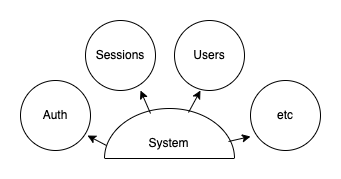
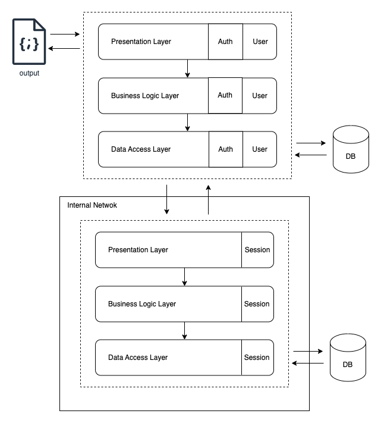
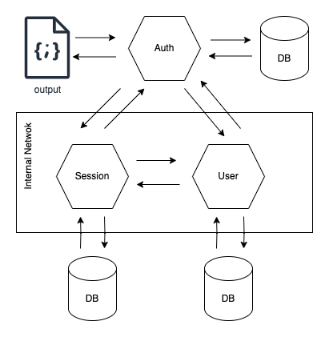

# Architecture Demo

This repository is more than a project; it's a software architecture demonstration.

It covers various aspects of building a monolithic service versus microservices, module development, and three-tier development.

## **Three-Tier Development**

* The presentation layer handles the user interface and interactions, including handling HTTP requests and generating responses. Controllers and routing are key components of the presentation layer.
* The business logic layer contains the core logic of the application and processes data based on business rules. These layers also handle authentication and authorization.
* The data access layer interacts with the underlying data storage, handling data retrieval, manipulation, and storage. This layer also utilizes technologies like ODM or ORM to interact with the database.

**Benefits**

* The three-tier architecture promotes modularity and separation of concerns.
* Each layer has distinct responsibilities, allowing for independent development and maintenance.
* Each layer can be changed without affecting the other layers; the presentation layer can change from REST to SOAP to gRPC, or the database from MYSQL to Mongo to ArangoDB.

## **Modularity**

Modularity in programming is a fundamental concept. It refers to the practice of dividing a program into smaller, manageable modules, each with well-defined functions and responsibilities. In other words, it's about breaking down a program into smaller and more manageable parts, rather than having a massive, monolithic codebase.

**Benefits**

* Code reusability, as modules can be reused in different parts of a project or even in different projects.
* Facilitates teamwork because it allows different team members to focus on specific modules.
* Maintenance is easier.
* Module division facilitates error identification and correction, and modules can be tested independently.

## **Monolith**

Following the above concepts, we can build a monolith that allows working even in large teams since the modules are well-defined. However, the question would be whether it's worth complicating programming for simple development. The answer is that it's worth learning, but for small-scale development where there is only one developer and no scaling is anticipated, it is not recommended.

**Benefits**

* It's a good starting point since the costs of having a monolith when there is little traffic are better.
* The monolith can later be easily divided into microservices by creating different repositories.

## **Microservices**

You can break down the monolith into two or more microservices with two approaches: 1) using a broker to avoid moving connections and keep everything communicating in the same way, or 2) allowing different consumers to consume the various endpoints.

### **Two Microservices**

When separating into microservices, many factors must be considered, the two being:

* Traffic a module receives
* Keeping sensitive modules together, such as user authentication

Here, both services can be consumed publicly, which has its cost benefits but adds complexity to consuming systems.

### **Two Microservices with Broker**

The modification here is straightforward: public access is removed, and the service is encapsulated within the internal network and consumed through the broker. The advantage is that the services consuming it do not have to change as they do between monoliths and microservices. The disadvantage is that if the service with the highest traffic is separated, both microservices must have the same size.

### **Three Microservices**

Here, all modules are separated, and Auth communicates with User and Session, while Session only communicates with User. This approach might sound like an overuse of microservices, but horizontal scalability is where it offers the most flexibility. The strongest weakness of this scheme is that endpoints with sensitive information must be exposed, so additional encryption between microservices is necessary to prevent data loss through scraping or attacks like man-in-the-middle.

### **Three Microservices with Broker**

To add an extra layer of security, an external broker can be used for microservices or one of the microservices that already have access to them, like the broker. All services except the broker should be in an internal network so they cannot be publicly accessed. Additionally, this service will function identically to the monolith.
